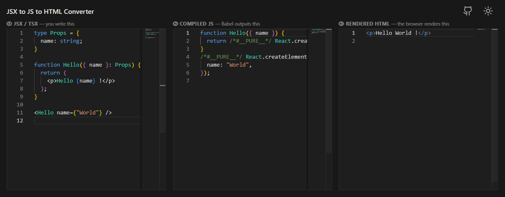

# JSX → JS → HTML

A single-file, zero-build interactive tool that shows how JSX becomes the HTML a browser actually renders.

Paste or edit JSX/TSX on the left, then watch Babel's compiled JavaScript and the final rendered HTML update live beside it.

## Usage

Just open [`index.html`](./index.html) in a web browser — no build step, no server, no `npm install`.

## What it does

| Panel            | Content                                                              |
| ---------------- | -------------------------------------------------------------------- |
| 1. JSX / TSX     | Editable input — write any JSX or TSX here                           |
| 2. Compiled JS   | Babel output using the classic runtime (`React.createElement` calls) |
| 3. Rendered HTML | The actual DOM innerHTML after React renders your component tree     |

TypeScript types are stripped automatically, so TSX works out of the box.

## Credits / Dependencies (all CDN, no install)

| Library                                                              | Purpose                                       |
| -------------------------------------------------------------------- | --------------------------------------------- |
| [Monaco Editor](https://github.com/microsoft/monaco-editor)          | Syntax-highlighted code editors               |
| [Babel](https://babeljs.io/docs/babel-standalone)                    | In-browser JSX + TypeScript compilation       |
| [React](https://react.dev)                                           | Rendering JSX to real DOM for HTML extraction |
| [Prettier](https://prettier.io/docs/browser)                         | Formatting the JS and HTML output panels      |
| [modern-normalize](https://github.com/sindresorhus/modern-normalize) | CSS reset                                     |
| [vscode-codicons](https://github.com/microsoft/vscode-codicons)      | Icon font used by Monaco Editor               |
| [lucide-static](https://lucide.dev/guide/packages/lucide-static)     | Icons                                         |

## License

[MIT](./license.txt)
